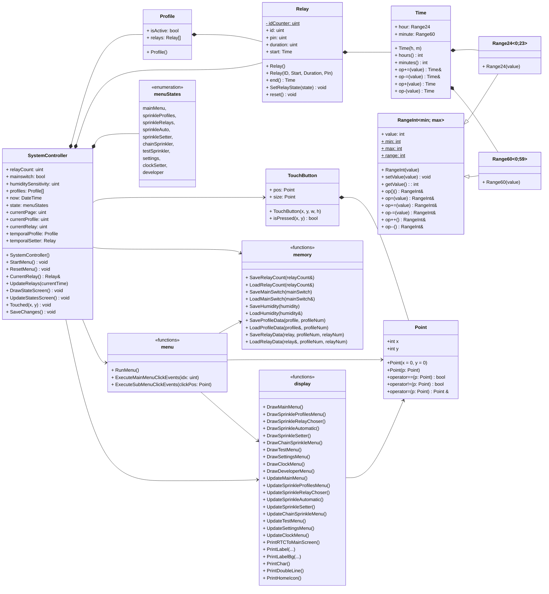
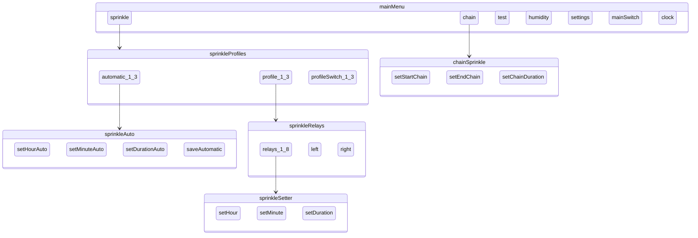

# Locsolórendszer - MinimalistGUI_v2024

> Készítette: Szenes Márton

---

# Tartalom

- [Locsolórendszer - MinimalistGUI\_v2024](#locsolórendszer---minimalistgui_v2024)
- [Tartalom](#tartalom)
- [Rendszer felépítése](#rendszer-felépítése)
  - [Állapotok - `menuStates`](#állapotok---menustates)
  - [Koordináta struktúra - `Point`](#koordináta-struktúra---point)
    - [Attribútumok](#attribútumok)
    - [Konstruktorok](#konstruktorok)
    - [Operátorok](#operátorok)
  - [Intervallum osztály - `RangeInt`](#intervallum-osztály---rangeint)
    - [Template paraméterek](#template-paraméterek)
    - [Attribútumok](#attribútumok-1)
    - [Statikus konstansok](#statikus-konstansok)
    - [Konstruktorok](#konstruktorok-1)
    - [Metódusok](#metódusok)
  - [60-as intervallum - `Range60`](#60-as-intervallum---range60)
    - [Konstruktorok](#konstruktorok-2)
  - [24-es intervallum - `Range24`](#24-es-intervallum---range24)
    - [Konstruktorok](#konstruktorok-3)
  - [Idő osztály - `Time`](#idő-osztály---time)
    - [Attribútumok](#attribútumok-2)
    - [Konstruktorok](#konstruktorok-4)
    - [Metódusok](#metódusok-1)
    - [Operátorok](#operátorok-1)
  - [Nyomógomb osztály- `TouchButton`](#nyomógomb-osztály--touchbutton)
    - [Attribútumok](#attribútumok-3)
    - [Konstruktorok](#konstruktorok-5)
    - [Metódusok](#metódusok-2)
- [Menürendszer](#menürendszer)
  - [Főképernyő](#főképernyő)
    - [Időzítés mentése](#időzítés-mentése)
  - [Locsolás időzítés](#locsolás-időzítés)
    - [Profil választó](#profil-választó)
    - [Automatizált időzítés](#automatizált-időzítés)
    - [Relé választás](#relé-választás)
    - [Relé időzítése manuálisan](#relé-időzítése-manuálisan)
  - [Sorban locsolás](#sorban-locsolás)
  - [Tesztelés](#tesztelés)
  - [Beállítások](#beállítások)
  - [Fejlesztői beállítások](#fejlesztői-beállítások)
  - [Idő beállítása](#idő-beállítása)
  - [Osztályszerkezet](#osztályszerkezet)

# Rendszer felépítése

## Állapotok - `menuStates`

A menü állapotait kódoló enum:
* **mainMenu** → _Főképernyő_:  A 5 fő almenü választó gomb található itt, illetve a mentés gomb.
* **sprinkleProfiles** → _Profil választó_: Itt lehet kiválasztani a 3 profil közül, hogy melyik időzítését módosítsuk, illetve ki/be kapcsoljuk.
* **sprinkleRelays** → _Relé választó_: Itt lehet kiválasztani, melyik relé időzítését módosítjuk.
* **sprinkleAuto** → _Automatikus időzítés_: Egy választott profil első reléjétől kezdődően időzíthető a többi relé is.
* **sprinkleSetter** → _Relé időzítése manuálisan_: A kiválasztott relé indítási idejét és időtartamát lehet módosítani.
* **chainSprinkler** → _Sorban locsolás_: Egy meghatározott relé intervallumon lehet egymás után locsoltatni egy bizonyos időtartamonként.
* **testSprinkler** → _Tesztelés_: Az egyes reléket egyesével lehet egy-egy kapcsolóbal ki-be kapcsolni. 
* **settings** → _Beállítások_: A rendzsert itt lehet be-kikapcsolni, a relék számát és nedvesség érzékenységet állítani. 
* **clockSetter** → _Óra beállítása_: A valós idő beállítása.
* **developer** → _Fejlesztői beállítások_: Fejlesztői panel, ahol a soros porton keresztül adatokat küld a rednszer a számítógépre az aktuális beállításokról.
    
## Koordináta struktúra - `Point`

Ez az osztály egy pontot reprezentál a kétdimenziós térben.

### Attribútumok
`int x` - A pont x koordinátája.
`int y` - A pont y koordinátája.

### Konstruktorok
Alapértelmezett konstruktor: Inicializálja a pontot a megadott koordinátákra. Ha nem adunk meg koordinátákat, akkor a pontot (0, 0) koordinátára állítja.

### Operátorok
- Egyenlőség operátor: Összehasonlít két pontot egyenlőség szempontjából. (Az == operátor akkor ad vissza true értéket, ha a két pont koordinátái megegyeznek.)
- Egyenlőtlenség operátor: Összehasonlít két pontot egyenlőtlenség szempontjából. (A != operátor akkor ad vissza true értéket, ha a két pont koordinátái eltérnek.)
- Értékadás operátor: Hozzárendeli egy pont koordinátáit egy másik ponthoz. (Az értékadás operátor (==) az ön-hozzárendelés ellenőrzését is végrehajtja, hogy elkerülje az önhozzárendelést. Ha a pont önmagához van rendelve, akkor nem történik változás.)

## Intervallum osztály - `RangeInt`

A `RangeInt` sablon osztály lehetővé teszi olyan egész számok létrehozását, amelyek egy megadott tartományon belül vannak korlátozva. Az értékek beállításakor vagy módosításakor automatikusan a tartomány határain belül maradnak.

### Template paraméterek
`lowerLimit` - A tartomány alsó határa.
`upperLimit` - A tartomány felső határa.  

### Attribútumok
`int value` - Az aktuális érték a megadott tartományon belül.  

### Statikus konstansok
`static const int minLimit` - A tartomány minimum határa.
`static const int maxLimit` - A tartomány maximum határa.
`static const int range` - A tartomány mérete.  

### Konstruktorok
`RangeInt(int value = 0)`: Inicializálja a tartományt és az értéket. Az alapértelmezett érték 0.

### Metódusok
`void setValue(int val)`: Beállítja az értéket a tartomány határain belül, szükség esetén körbeérve.
`int getValue() const`: Visszaadja az aktuális értéket a tartományon belül.
`int operator()() const`: Visszaadja az aktuális értéket a tartományon belül.
`RangeInt &operator=(int val)`: Új értéket rendel a tartományhoz, a tartomány határainak figyelembevételével.
`RangeInt &operator+=(int increment)`: Növeli az aktuális értéket egy adott értékkel, a tartomány határainak figyelembevételével.
`RangeInt &operator-=(int decrement)`: Csökkenti az aktuális értéket egy adott értékkel, a tartomány határainak figyelembevételével.
`RangeInt &operator++()`: Növeli az aktuális értéket 1-el, a tartomány határainak figyelembevételével.
`RangeInt operator++(int)`: Növeli az aktuális értéket 1-el, a tartomány határainak figyelembevételével, és visszaadja a korábbi értéket.
`RangeInt &operator--()`: Csökkenti az aktuális értéket 1-el, a tartomány határainak figyelembevételével.
`RangeInt operator--(int)`: Csökkenti az aktuális értéket 1-el, a tartomány határainak figyelembevételével, és visszaadja a korábbi értéket.

## 60-as intervallum - `Range60`
A `RangeInt` egy specializációja, amely értékeket tartalmaz a **0** és **59** közötti tartományban.

### Konstruktorok
`Range60(int value = 0)`: Inicializálja a tartományt egy opcionális kezdőértékkel. Az alapértelmezett érték 0.

## 24-es intervallum - `Range24`
A `RangeInt` egy specializációja, amely értékeket tartalmaz a **0** és **23** közötti tartományban.

### Konstruktorok
`Range24(int value = 0)`: Inicializálja a tartományt egy opcionális kezdőértékkel. Az alapértelmezett érték 0.

## Idő osztály - `Time`
A `Time` struktúra egy időt reprezentál, amely órákból és percekből áll.

### Attribútumok
`Range24 hour` - Az idő óra komponense.
`Range60 minute` - Az idő perc komponense.

### Konstruktorok
`Time(int h = 0, int m = 0)`: Inicializálja az időt a megadott órával és perccel. Az alapértelmezett értékek 0.

### Metódusok
`int hours() const`: Visszaadja az aktuális óra értékét.
`int minutes() const`: Visszaadja az aktuális perc értékét.

### Operátorok
`Time& operator+=(int plusMin)`: Hozzáad egy adott számú percet az aktuális időhöz, szükség esetén módosítva az órát is.
`Time& operator-=(int subMin)`: Kivon egy adott számú percet az aktuális időből, szükség esetén módosítva az órát is.
`Time operator+(int plusMin)`: Hozzáad egy adott számú percet az aktuális időhöz, szükség esetén módosítva az órát is, és visszaad egy új Time objektumot a frissített idővel.
`Time operator-(int subMin)`: Kivon egy adott számú percet az aktuális időből, szükség esetén módosítva az órát is, és visszaad egy új Time objektumot a frissített idővel.

## Nyomógomb osztály- `TouchButton`
A TouchButton struktúra egy érintőképernyős gombot reprezentál a felhasználói felületen. Meghatározza a gomb pozícióját és méretét, valamint biztosít metódusokat annak megállapítására, hogy a gomb meg van-e nyomva.

### Attribútumok
`Point pos` - A gomb bal felső sarkának pozíciója.
`Point size` - A gomb mérete.
### Konstruktorok
`TouchButton()`: Alapértelmezett konstruktor, amely a gomb pozícióját és méretét (0, 0) értékre inicializálja. Főként gomb tömbök létrehozására használatos.
`TouchButton(const int x, const int y, const int width, const int height)`: Konstruktor alapvető paraméterekkel, amely a gombot a megadott pozícióval és mérettel inicializálja.
`TouchButton(const Point& position, const Point& size)`: Konstruktor haladó paraméterekkel, amely a gombot a megadott pozícióval és mérettel inicializálja.

### Metódusok
`bool isPressed(const int x, const int y) const`: Ellenőrzi, hogy a megadott koordináta a gombon belül van-e. Visszatérési érték: true, ha a koordináta a gombon belül van, egyébként false.
`bool isPressed(const Point& p) const`: Ellenőrzi, hogy a megadott pont a gombon belül van-e. Visszatérési érték: true, ha a pont a gombon belül van, egyébként false.

# Menürendszer

## Főképernyő

### Időzítés mentése

## Locsolás időzítés

### Profil választó

### Automatizált időzítés

### Relé választás

### Relé időzítése manuálisan

## Sorban locsolás

## Tesztelés

## Beállítások

## Fejlesztői beállítások

## Idő beállítása

## Osztályszerkezet

