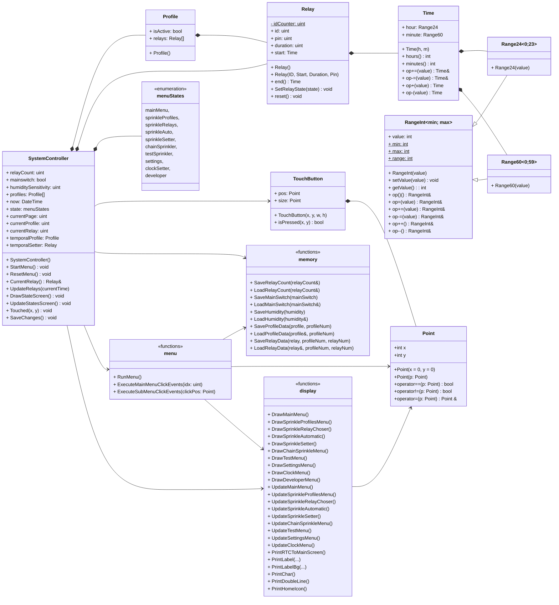
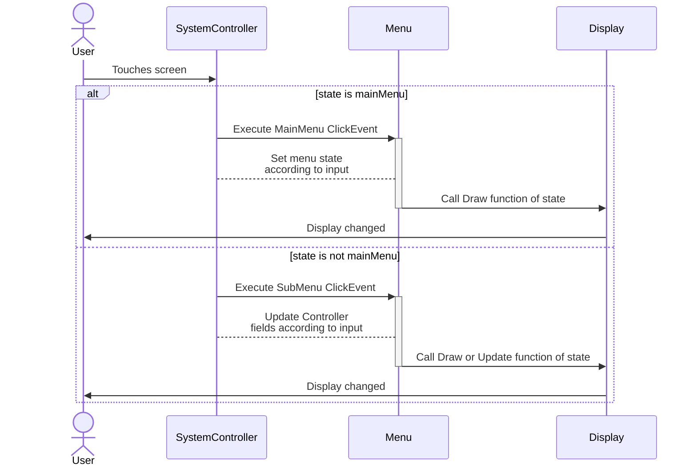

# Fejlesztői dokumentáció - MinimalistSprinklerGUI v2024

> Írta: Szenes Márton - 2024.08.21.

---

# Tartalom

- [Fejlesztői dokumentáció - MinimalistSprinklerGUI v2024](#fejlesztői-dokumentáció---minimalistsprinklergui-v2024)
- [Tartalom](#tartalom)
- [Rendszer struktúrális felépítése](#rendszer-struktúrális-felépítése)
  - [Állapotok - `menuStates`](#állapotok---menustates)
  - [Koordináta struktúra - `Point`](#koordináta-struktúra---point)
    - [Attribútumok](#attribútumok)
    - [Konstruktorok](#konstruktorok)
    - [Operátorok](#operátorok)
  - [Intervallum osztály - `RangeInt`](#intervallum-osztály---rangeint)
    - [Template paraméterek](#template-paraméterek)
    - [Attribútumok](#attribútumok-1)
    - [Statikus konstansok](#statikus-konstansok)
    - [Konstruktorok](#konstruktorok-1)
    - [Metódusok](#metódusok)
  - [60-as intervallum - `Range60`](#60-as-intervallum---range60)
    - [Konstruktorok](#konstruktorok-2)
  - [24-es intervallum - `Range24`](#24-es-intervallum---range24)
    - [Konstruktorok](#konstruktorok-3)
  - [Idő osztály - `Time`](#idő-osztály---time)
    - [Attribútumok](#attribútumok-2)
    - [Konstruktorok](#konstruktorok-4)
    - [Metódusok](#metódusok-1)
    - [Operátorok](#operátorok-1)
  - [Nyomógomb osztály- `TouchButton`](#nyomógomb-osztály--touchbutton)
    - [Attribútumok](#attribútumok-3)
    - [Konstruktorok](#konstruktorok-5)
    - [Metódusok](#metódusok-2)
  - [Szektor kapcsoló struktúra - `Relay`](#szektor-kapcsoló-struktúra---relay)
    - [Attribútumok](#attribútumok-4)
    - [Konstruktorok](#konstruktorok-6)
    - [Metódusok](#metódusok-3)
  - [Profil struktúra - `Profile`](#profil-struktúra---profile)
    - [Attribútumok](#attribútumok-5)
    - [Konstruktorok](#konstruktorok-7)
  - [Vezérlő struktúra - `SystemController`](#vezérlő-struktúra---systemcontroller)
    - [Attribútumok](#attribútumok-6)
      - [Mentett konfigurációs tulajdonásgok](#mentett-konfigurációs-tulajdonásgok)
      - [Futó konfigurációs tulajdonságok](#futó-konfigurációs-tulajdonságok)
      - [Ideiglenes tulajdonságok a felkonfiguráláshoz](#ideiglenes-tulajdonságok-a-felkonfiguráláshoz)
    - [Konstruktorok](#konstruktorok-8)
    - [Metódusok](#metódusok-4)
- [Memóriakezelés](#memóriakezelés)
  - [EEPROM elosztása](#eeprom-elosztása)
  - [Függvények](#függvények)
    - [Relék számának mentése és betöltése](#relék-számának-mentése-és-betöltése)
    - [Főkapcsoló állapotának mentése és betöltése](#főkapcsoló-állapotának-mentése-és-betöltése)
    - [Páratartalom érzékenység mentése és betöltése](#páratartalom-érzékenység-mentése-és-betöltése)
    - [Profil adatok mentése és betöltése](#profil-adatok-mentése-és-betöltése)
    - [Relé adatok mentése és betöltése](#relé-adatok-mentése-és-betöltése)
- [Kijelző](#kijelző)
  - [Metódusok](#metódusok-5)
- [Diagrammok](#diagrammok)
  - [Osztálydiagramm](#osztálydiagramm)
  - [Touch event](#touch-event)

# Rendszer struktúrális felépítése

## Állapotok - `menuStates`

> [a_enums.ino](../MinimalistSprinklerGUI/a_enums.ino)

A menü állapotait kódoló enumerátor:
* **mainMenu** → _Főképernyő_:  A 5 fő almenü választó gomb található itt, illetve a mentés gomb.
* **sprinkleProfiles** → _Profil választó_: Itt lehet kiválasztani a 3 profil közül, hogy melyik időzítését módosítsuk, illetve ki/be kapcsoljuk.
* **sprinkleRelays** → _Relé választó_: Itt lehet kiválasztani, melyik relé időzítését módosítjuk.
* **sprinkleAuto** → _Automatikus időzítés_: Egy választott profil első reléjétől kezdődően időzíthető a többi relé is.
* **sprinkleSetter** → _Relé időzítése manuálisan_: A kiválasztott relé indítási idejét és időtartamát lehet módosítani.
* **chainSprinkler** → _Sorban locsolás_: Egy meghatározott relé intervallumon lehet egymás után locsoltatni egy bizonyos időtartamonként.
* **testSprinkler** → _Tesztelés_: Az egyes reléket egyesével lehet egy-egy kapcsolóbal ki-be kapcsolni. 
* **settings** → _Beállítások_: A rendzsert itt lehet be-kikapcsolni, a relék számát és nedvesség érzékenységet állítani. 
* **clockSetter** → _Óra beállítása_: A valós idő beállítása.
* **developer** → _Fejlesztői beállítások_: Fejlesztői panel, ahol a soros porton keresztül adatokat küld a rednszer a számítógépre az aktuális beállításokról.
    
## Koordináta struktúra - `Point`

> [a_point.ino](../MinimalistSprinklerGUI/a_point.ino)

Ez az osztály egy pontot reprezentál a kétdimenziós térben.

### Attribútumok
`int x` - A pont x koordinátája.  
`int y` - A pont y koordinátája.

### Konstruktorok
Alapértelmezett konstruktor: Inicializálja a pontot a megadott koordinátákra. Ha nem adunk meg koordinátákat, akkor a pontot (0, 0) koordinátára állítja.

### Operátorok
- Egyenlőség operátor: Összehasonlít két pontot egyenlőség szempontjából. (Az == operátor akkor ad vissza true értéket, ha a két pont koordinátái megegyeznek.)
- Egyenlőtlenség operátor: Összehasonlít két pontot egyenlőtlenség szempontjából. (A != operátor akkor ad vissza true értéket, ha a két pont koordinátái eltérnek.)
- Értékadás operátor: Hozzárendeli egy pont koordinátáit egy másik ponthoz. (Az értékadás operátor (==) az ön-hozzárendelés ellenőrzését is végrehajtja, hogy elkerülje az önhozzárendelést. Ha a pont önmagához van rendelve, akkor nem történik változás.)

## Intervallum osztály - `RangeInt`

> [a_range.ino](../MinimalistSprinklerGUI/a_range.ino)

A `RangeInt` sablon osztály lehetővé teszi olyan egész számok létrehozását, amelyek egy megadott tartományon belül vannak korlátozva. Az értékek beállításakor vagy módosításakor automatikusan a tartomány határain belül maradnak.

### Template paraméterek
`lowerLimit` - A tartomány alsó határa.  
`upperLimit` - A tartomány felső határa.  

### Attribútumok
`int value` - Az aktuális érték a megadott tartományon belül.  

### Statikus konstansok
`static const int minLimit` - A tartomány minimum határa.  
`static const int maxLimit` - A tartomány maximum határa.  
`static const int range` - A tartomány mérete.  

### Konstruktorok
`RangeInt(int value = 0)`: Inicializálja a tartományt és az értéket. Az alapértelmezett érték 0.

### Metódusok
`void setValue(int val)`: Beállítja az értéket a tartomány határain belül, szükség esetén körbeérve.  
`int getValue() const`: Visszaadja az aktuális értéket a tartományon belül.  
`int operator()() const`: Visszaadja az aktuális értéket a tartományon belül.  
`RangeInt &operator=(int val)`: Új értéket rendel a tartományhoz, a tartomány határainak figyelembevételével.  
`RangeInt &operator+=(int increment)`: Növeli az aktuális értéket egy adott értékkel, a tartomány határainak figyelembevételével.  
`RangeInt &operator-=(int decrement)`: Csökkenti az aktuális értéket egy adott értékkel, a tartomány határainak figyelembevételével.  
`RangeInt &operator++()`: Növeli az aktuális értéket 1-el, a tartomány határainak figyelembevételével.  
`RangeInt operator++(int)`: Növeli az aktuális értéket 1-el, a tartomány határainak figyelembevételével, és visszaadja a korábbi értéket.  
`RangeInt &operator--()`: Csökkenti az aktuális értéket 1-el, a tartomány határainak figyelembevételével.  
`RangeInt operator--(int)`: Csökkenti az aktuális értéket 1-el, a tartomány határainak figyelembevételével, és visszaadja a korábbi értéket.  

## 60-as intervallum - `Range60`
A `RangeInt` egy specializációja, amely értékeket tartalmaz a **0** és **59** közötti tartományban.

### Konstruktorok
`Range60(int value = 0)`: Inicializálja a tartományt egy opcionális kezdőértékkel. Az alapértelmezett érték 0.

## 24-es intervallum - `Range24`
A `RangeInt` egy specializációja, amely értékeket tartalmaz a **0** és **23** közötti tartományban.

### Konstruktorok
`Range24(int value = 0)`: Inicializálja a tartományt egy opcionális kezdőértékkel. Az alapértelmezett érték 0.

## Idő osztály - `Time`
> [a_time.ino](../MinimalistSprinklerGUI/a_time.ino)

A `Time` struktúra egy időt reprezentál, amely órákból és percekből áll.

### Attribútumok
`Range24 hour` - Az idő óra komponense.  
`Range60 minute` - Az idő perc komponense.

### Konstruktorok
`Time(int h = 0, int m = 0)`: Inicializálja az időt a megadott órával és perccel. Az alapértelmezett értékek 0.

### Metódusok
`int hours() const`: Visszaadja az aktuális óra értékét.  
`int minutes() const`: Visszaadja az aktuális perc értékét.

### Operátorok
`Time& operator+=(int plusMin)`: Hozzáad egy adott számú percet az aktuális időhöz, szükség esetén módosítva az órát is.  
`Time& operator-=(int subMin)`: Kivon egy adott számú percet az aktuális időből, szükség esetén módosítva az órát is.  
`Time operator+(int plusMin)`: Hozzáad egy adott számú percet az aktuális időhöz, szükség esetén módosítva az órát is, és visszaad egy új Time objektumot a frissített idővel.  
`Time operator-(int subMin)`: Kivon egy adott számú percet az aktuális időből, szükség esetén módosítva az órát is, és visszaad egy új Time objektumot a frissített idővel.  

## Nyomógomb osztály- `TouchButton`
> [b_button.ino](../MinimalistSprinklerGUI/b_button.ino)

A TouchButton struktúra egy érintőképernyős gombot reprezentál a felhasználói felületen. Tartalmazza a gomb pozícióját és méretét, valamint biztosít metódusokat annak megállapítására, hogy a gomb meg van-e nyomva.

### Attribútumok
`Point pos` - A gomb bal felső sarkának pozíciója.  
`Point size` - A gomb mérete.
### Konstruktorok
`TouchButton()`: Alapértelmezett konstruktor, amely a gomb pozícióját és méretét (0, 0) értékre inicializálja. Főként gomb tömbök létrehozására használatos.  
`TouchButton(const int x, const int y, const int width, const int height)`: Konstruktor alapvető paraméterekkel, amely a gombot a megadott pozícióval és mérettel inicializálja.  
`TouchButton(const Point& position, const Point& size)`: Konstruktor haladó paraméterekkel, amely a gombot a megadott pozícióval és mérettel inicializálja.

### Metódusok
`bool isPressed(const int x, const int y) const`: Ellenőrzi, hogy a megadott koordináta a gombon belül van-e. Visszatérési érték: true, ha a koordináta a gombon belül van, egyébként false.  
`bool isPressed(const Point& p) const`: Ellenőrzi, hogy a megadott pont a gombon belül van-e. Visszatérési érték: true, ha a pont a gombon belül van, egyébként false.

## Szektor kapcsoló struktúra - `Relay`
> [b_relay_profile.ino](../MinimalistSprinklerGUI/b_relay_profile.ino)

A `Relay` struktúra egy relét reprezentál, amely locsolórendszer egy szektorának vezérlésére szolgál.

### Attribútumok
`static uint idCounter` - Egyedi reléazonosítók generálásához használt számláló. Legfeljebb 256 relé használható.  
`uint id` - A relé egyedi azonosítója.  
`uint pin` - Arduino kártyán a pin száma, amelyhez a relé csatlakozik.  
`bool state` - Relé állapota.  
`Time start` - A locsolás kezdési ideje.  
`Range60 duration` - A locsolás időtartama percekben.

### Konstruktorok
`Relay(uint8_t pin = 0, struct Time start = 0, uint duration = 0)`: Inicializál egy relé példányt a megadott pin-számmal, kezdési idővel és időtartammal. Az alapértelmezett értékek 0.

### Metódusok
`Time end()`: Kiszámítja a locsolás befejezési idejét. Visszatérési érték: A locsolás befejezési ideje.  
`void SetRelayState(bool value)`: Beállítja a relé állapotát.  
`void reset()`: Visszaállítja a relé kezdési idejét és időtartamát 0-ra.

## Profil struktúra - `Profile`
> [b_relay_profile.ino](../MinimalistSprinklerGUI/b_relay_profile.ino)

A `Profile` struktúra egy profilt reprezentál, amely több relét tartalmaz. Tartalmazza a profil aktív állapotát és a relék tömbjét.

### Attribútumok
`bool isActive` - Jelzi, hogy a profil aktív-e.  
`Relay relays[MAX_RELAY_COUNT]` - A profilhoz tartozó relék tömbje. (Maximális számár a `MAX_RELAY_COUNT` makróval van deifiniálva)

### Konstruktorok
`Profile()`: Inicializál egy Profile példányt. A konstruktor beállítja a relék pin-számát és alapértelmezett állapotát. Az összes relé pin-számát beállítja a `RELAY_PINS` tömb értékeivel. Az összes relé alapértelmezett állapotát kikapcsolt állapotra (`false`) állítja.

## Vezérlő struktúra - `SystemController`
> [c_systemcontroller.ino](../MinimalistSprinklerGUI/c_systemcontroller.ino)

A `SystemController` struktúra a locsolórendszer fő vezérlőjét képviseli. Kezeli a futó- és elmentett konfigurációt, profilokat és a rendszer aktuális állapotát, beleértve a menü interakciók kezelésére és a relé állapotok frissítésére szolgáló metódusokat is.

### Attribútumok
#### Mentett konfigurációs tulajdonásgok
`unsigned char relayCount` - Használt relék száma (EEPROM-ban tárolva).  
`bool mainSwitch` - Főkapcsoló az időzített locsolás vezérlésére (EEPROM-ban tárolva).  
`uint humiditySensitivity` - A rendszer páratartalom-érzékenysége (EEPROM-ban tárolva).  
`Profile profiles[PROFILE_COUNT]` - Automatikus locsolás időprofiljainak tömbje (EEPROM-ban tárolva).

#### Futó konfigurációs tulajdonságok
`DateTime now` - Jelenlegi valós idő.  
`menuStates state` - A menü aktuális állapota.  
`uint currentPage` - A menü jelenlegi oldala.  
`uint currentProfile` - A szerkesztett profil indexe.  
`uint currentRelay` - A szerkesztett relé indexe.  
`bool unsavedChanges` - Jelzi, ha vannak nem mentett változások.

#### Ideiglenes tulajdonságok a felkonfiguráláshoz
`Profile temporalProfile` - Ideiglenes profil tesztelési célokra.  
`Relay temporalSetter` - Ideiglenes relé beállító tesztelési célokra.  
`uint temporalFromRelay` - Az ideiglenes profil kezdő reléje.  
`uint temporalToRelay` - Az ideiglenes profil befejező reléje.  
`char activeRelay` - 0: Nincs aktív relé, 1-16: számozott relé aktív.

### Konstruktorok
`SystemController()`: Inicializál egy SystemController példányt. Betölti a változókat az EEPROM-ból. Inicializálja a reléket és beállítja a menüt alapállapotba.

### Metódusok
`StartMenu()`: Elindítja a menü felületet, inicializálja a menü állapotát és futtatja a menüt.  
`ResetMenu()`: Visszaállítja a menü állapotát és az ideiglenes beállításokat.  
`UpdateRelays()`: Frissíti az összes relé állapotát az aktuális idő alapján. Bekapcsolja vagy kikapcsolja a reléket a profilok időzítései és a főkapcsoló állapota alapján.  
`Touched(int x, int y)`: Kezeli az érintési eseményeket. Teszteli a főmenü és almenü gombjait az érintés koordinátái alapján.  
`SaveChanges()`: Elmenti a jelenlegi konfigurációt az EEPROM-ba.  
`Relay& CurrentRelay()`: Visszaadja a jelenleg kiválasztott relét referenciaként.

# Memóriakezelés

Az elmentett konfigurációs tulajdonságokat az arduino az EEPROM-jában tárolja el. Ennek használata biztosítja, hogy az adatok újraindítás után is megmaradjanak. 

## EEPROM elosztása

| Index  |             Tartalom             |
|:------:|:--------------------------------:|
|   0    |                -                 |
|   1    |        mainSwitchAddress         |
|   2    |         humidityAddress          |
|   3    | profileStartAddress: P1/isActive |
|   ⋮    |            P1/R1/hour            |
|   ⋮    |           P1/R1/minute           |
|   ⋮    |          P1/R1/duration          |
|   ⋮    |            P1/R2/hour            |
|   ⋮    |                ⋮                 |
|   52   |           P2/isActive            |
|   ⋮    |                ⋮                 |
|  101   |           P3/isActive            |
|   ⋮    |                ⋮                 |

## Függvények
Az EEPROM kezelésésre az alábbi függvények szolgálnak, melyek a  `q_memory.ino` fájlban.

### Relék számának mentése és betöltése
`SaveRelayCount(uint relayCount)`: Relé szám mentése az EEPROM-ba. A mentendő relék számát a függvény paraméterében kell megadni.  
`LoadRelayCount(uint& relayCount)`: Relé szám betöltése az EEPROM-ból. A betöltött értéket a függvény paraméterében megadott változó tárolja.

### Főkapcsoló állapotának mentése és betöltése
`SaveMainSwitch(bool mainSwitch)`: Főkapcsoló állapotának mentése az EEPROM-ba. A mentendő állapotot a függvény paraméterében kell megadni.  
`LoadMainSwitch(bool& mainSwitch)`: Főkapcsoló állapotának betöltése az EEPROM-ból. A betöltött értéket a függvény paraméterében megadott változó tárolja.

### Páratartalom érzékenység mentése és betöltése
`SaveHumidity(uint humidity)`: Páratartalom érzékenység mentése az EEPROM-ba. A mentendő értéket a függvény paraméterében kell megadni.  
`LoadHumidity(uint& humidity)`: Páratartalom érzékenység betöltése az EEPROM-ból. A betöltött értéket a függvény paraméterében megadott változó tárolja.

### Profil adatok mentése és betöltése
`SaveProfileData(Profile profile, int profileNumber)`: Profil mentése az EEPROM-ba. A profil adatait és indexét a függvény paramétereiben kell megadni.  
`LoadProfileData(Profile &profile, int profileNumber)`: Profil betöltése az EEPROM-ból. A betöltött adatokat a függvény paraméterében megadott változó tárolja, a profil indexét szintén paraméterként kell megadni.

### Relé adatok mentése és betöltése
`SaveRelayData(Relay rel, int profileNumber, int relayNumber)`: Relé adatok mentése az EEPROM-ba. A relé adatait, a profil és a relé indexét a függvény paramétereiben kell megadni.  
`LoadRelayData(Relay &rel, int profileNumber, int relayNumber)`: Relé adatok betöltése az EEPROM-ból. A betöltött adatokat a függvény paraméterében megadott változó tárolja, a profil és a relé indexét szintén paraméterként kell megadni.

# Kijelző

A locsolórendszer ***MinimalisSprinkleGUI_2024*** verziója egy 2,8" colos TFT érintőképeernyős kijelzővel kommunikál a felhasználóval.
A kijelző mérete 320×240 pixel. (A shield típusa: ILI9341)

A kijelzőre való rajzolásért és a képernyőn lévő adatok frissítéséért a `d_display.ino` fájlban lévő eljárások felelősek.
Minden menü állapotnak van egy `Draw...` és egy `Update...` függvénye. Ezekből értelemszerűen például a `DrawMainMenu()` függvény letörli a képernyőt és kirajzolja a főmenüt, az `UpdateMainMenu()` függvény pedig a főmenüben történő vizuális változásokat éri el.

## Metódusok

### Rajzoló eljárások

`DrawMainMenu()`: Megrajzolja a főmenüt a képernyőre: "Öntözési időzítés", "Lánc locsolás", "Teszt", "Beállítások" és "Óra beállítások". Végül frissíti az aktuális időt és a mentés gomb állapotát.  
`DrawSprinkleProfilesMenu()`: Megrajzolja az öntözési profilok menüjét a képernyőre: Három különböző profilhoz tartozó gombokat jelenít meg, amelyek között van egy nagyobb gomb a profil kiválasztásához, és két kisebb gomb az automatikus beállításokhoz, illetve a profil ki/be állapotának jelzésére.    
`DrawSprinkleRelayChooser()`: Megrajzolja az öntöző relék kiválasztó menüjét a képernyőre: Két nyílgombot (< és >) rajzol, amelyekkel a relék között lehet navigálni és egy "Vissza" gombot, amely visszavisz az előző menübe. Ezután frissíti a relé gombokat és a hozzájuk tartozó számokat.  
`DrawSprinkleSetter()`: Megrajzolja az öntöző relé beállító felületét a képernyőre: A felület tartalmaz gombokat az óra, a perc és az időtartam növelésére vagy csökkentésére a kiválasztott öntöző profilban lévő relé számára. Illetve található még egy "Mentés" gomb és egy "Vissza" gomb, ami visszavisz az előző képernyőre.    
`DrawSprinkleAutomatic()`: Megrajzolja az öntözőrendszer automatikus beállítási felületét: A felületen be lehet állítani a választott profil automatikus időzítő kezdési időpontját (óra és perc) és az időtartamát, ami minden relére vonatkozni fog.  
`DrawChainSprinkleMenu()`: Megrajzolja a lánclocsolás beállítási felületét: A felhasználó megadhatja, hogy melyik relétől melyik reléig történjen az öntözés, valamint beállíthatja az egyes relék működési időtartamát.  
`DrawTestMenu()`: Megrajzolja a tesztmenü felületét: Lehetővé teszi a felhasználó számára, hogy manuálisan vezérelje és tesztelje a relék állapotait. A felületen találhatók nyilak az oldalak közötti váltáshoz, relék kapcsolói, valamint egy visszaállítási gomb az összes aktív relé leállításához.  
`DrawSettingsMenu()`: Megrajzolja a beállítások menü felületét, amely lehetővé teszi a felhasználó számára különféle rendszerbeállítások módosítását. A menü tartalmazza a relé számának beállítását, a páratartalom érzékenységét, valamint hozzáférést a fejlesztői beállításokhoz. A felületen egy főkapcsoló és egy visszaállítási gomb is található, amely a beállítások alaphelyzetbe állítására szolgál.  
`DrawClockMenu()`: Megrajzolja az óra beállításainak felületét, amely lehetővé teszi a felhasználó számára a valós idejű óra beállításainak módosítását. A menüben lehetőség van az órák és percek növelésére vagy csökkentésére, valamint egy mentés gomb biztosítja a változtatások megerősítését.      
`DrawDeveloperMenu()`: Megrajzolja  a Fejlesztői menü felületét, amely különféle opciókat biztosít a haladó beállításokhoz és diagnosztikához.   

### Képernyő frissítő eljárások

_Írás altt_

# Diagrammok

## Osztálydiagramm

## Touch event
