# Felhasználói kézikönyv - MinimalistSprinklerGUI v2024

> Írta: Szenes Márton - 2024.08.04.

---

# Tartalom

- [Felhasználói kézikönyv - MinimalistSprinklerGUI v2024](#felhasználói-kézikönyv---minimalistsprinklergui-v2024)
- [Tartalom](#tartalom)
- [Menürendszer](#menürendszer)
  - [Főképernyő](#főképernyő)
    - [Időzítés mentése](#időzítés-mentése)
  - [Locsolás időzítés](#locsolás-időzítés)
    - [Profil választó](#profil-választó)
    - [Automatizált időzítés](#automatizált-időzítés)
    - [Relé választás](#relé-választás)
    - [Relé időzítése manuálisan](#relé-időzítése-manuálisan)
  - [Sorban locsolás](#sorban-locsolás)
  - [Tesztelés](#tesztelés)
  - [Beállítások](#beállítások)
  - [Fejlesztői beállítások](#fejlesztői-beállítások)
  - [Idő beállítása](#idő-beállítása)

---

# Menürendszer

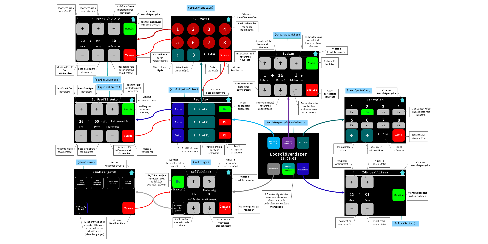

---

### Definíciók

**Locsolókör**: Egy kör két öntöző fejből áll, melyek megadott szektorokban vannak lerakva a kertben. Ezeket nevezzük locsolókörnek. Egyszerre csak egy kör lehet aktív, mert több esetén nincs elég nyomás, mert gyenge a szivattyú.

**Relé**: A kontroller által vezérelt digitális kapcsoló, ami kapcsolja a locsolókörök szelepét, ezáltal vezérelve, hogy melyik nyíljon ki, azaz kapjon vizet.

## Főmenü

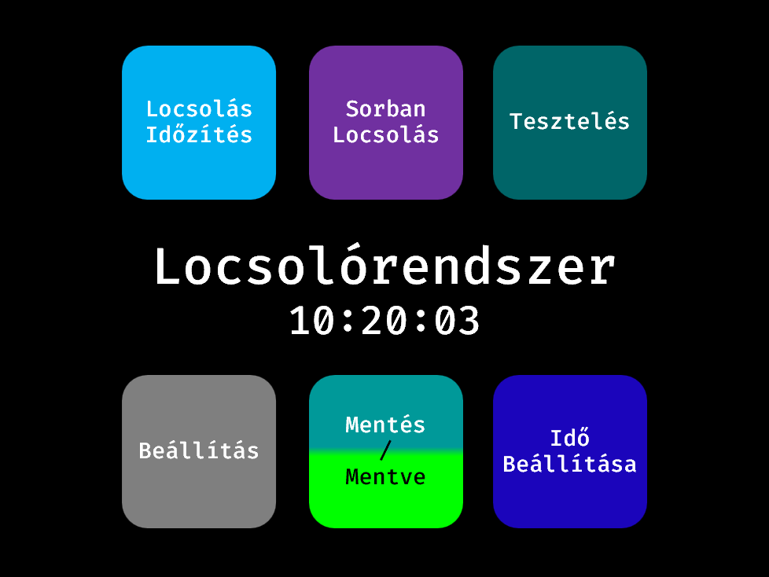

- **Locsolás időzítése**: A locsolórendszer **automatikus időzítéséhez** kattints a bal felső sarokban lévő világoskék gombra.
- **Sorban locsolás**: Ha most szeretnéd, hogy menjen végig egy locsolás valamely körtől valamely körig, akkor kattints a felső lila gombra.
- **Tesztelés**: Itt tudod megnézni, mely locsolókör aktív éppen ha egy locsolás van folyamatban, vagy tudsz kézzel bekapcsolni és kikapcsolni egy-egy kört.
- **Beállítások**: Itt található a locsololórendszer beállítása (Relék számának állítása, nedvesség érzékenység). Ehhez csak a rendszergazdának kell belenyúlnia.
- **Mentés/Mentve**: Ha módosítás történik a rendszerben, amit a hosszútávú memóriába kell menteni, akkor türkiz színű lesz a gomb. Ha sikerült a mentés, akkor zöld lesz a gomb
- **Idő beállítása**: Ha a valóstól eltérő lenne az idő a képernyőn, akkor kattints erre a gombra és állítsd be a valós időt. 

---

### Időzítés mentése

## Locsolás időzítés

### Profil választó

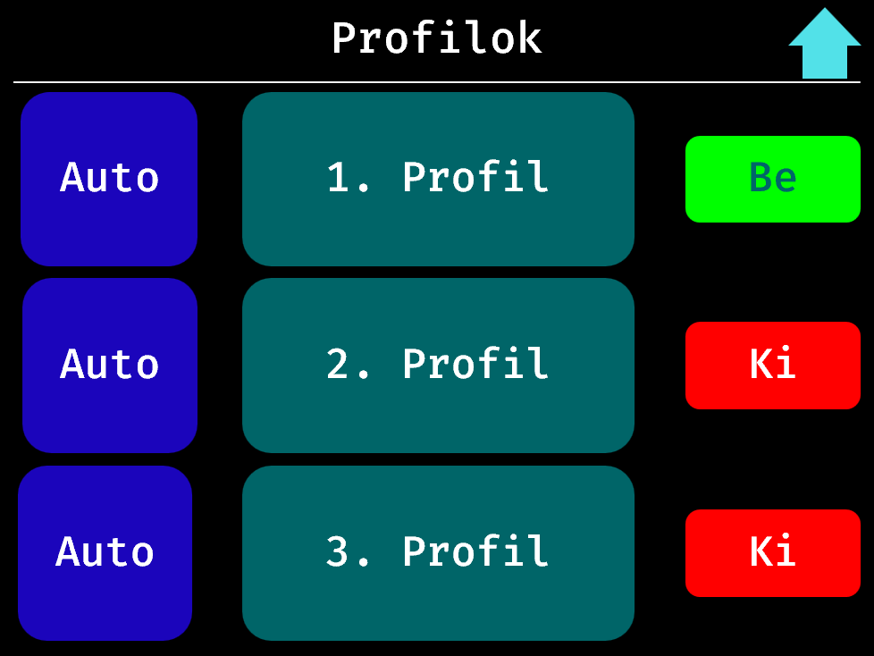

### Automatizált időzítés

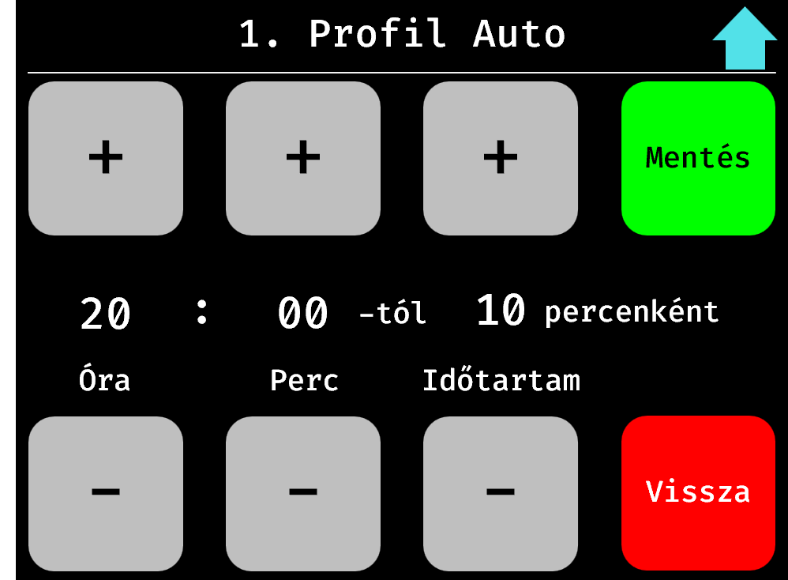

### Relé választás

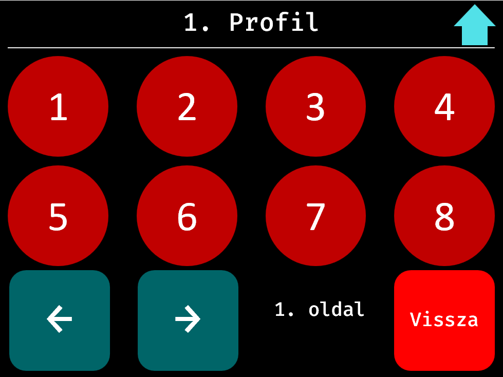

### Relé időzítése manuálisan

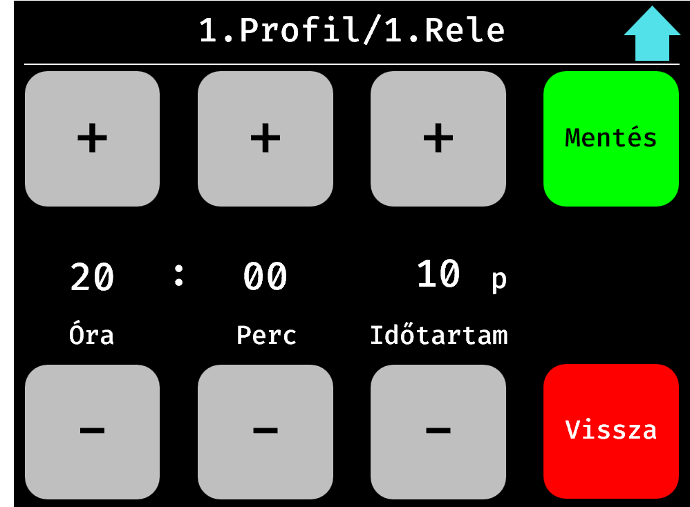

## Sorban locsolás

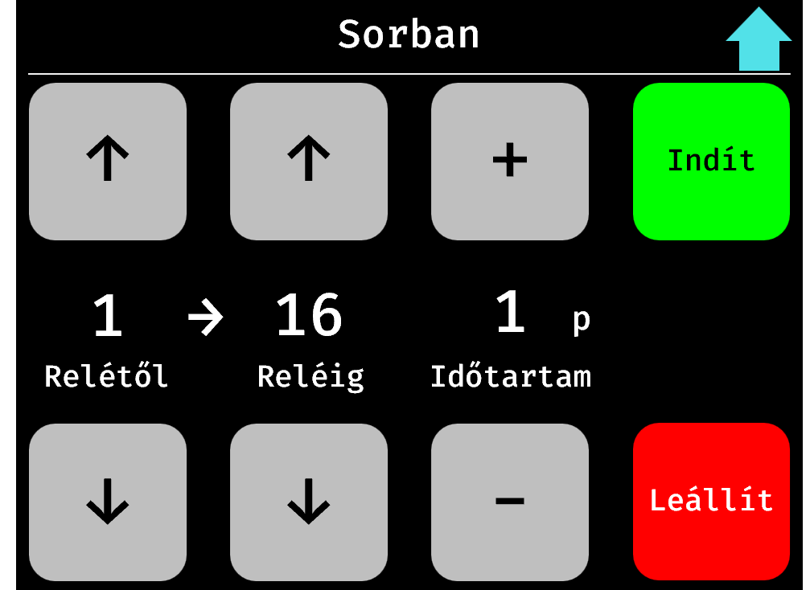

## Tesztelés

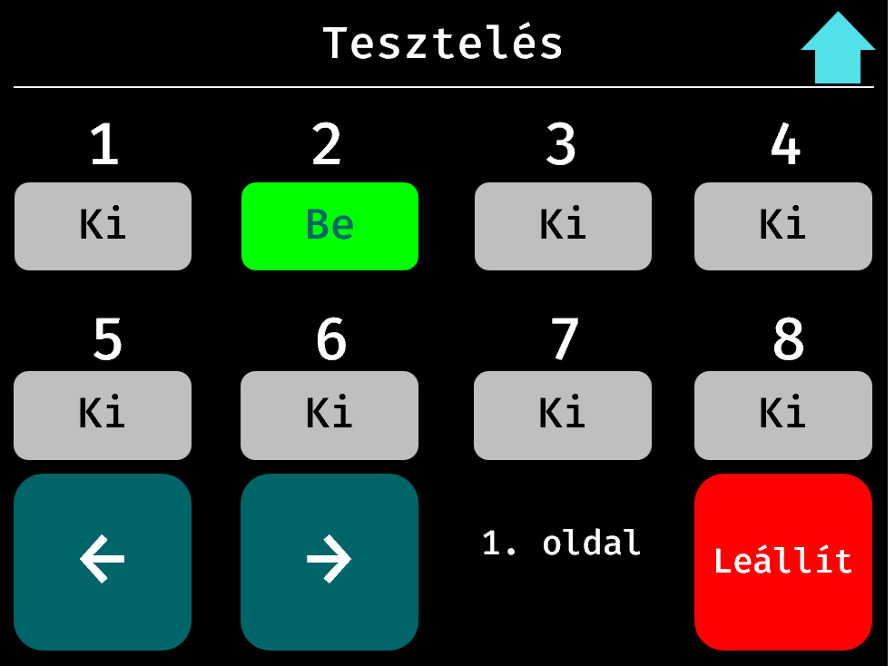

## Beállítások

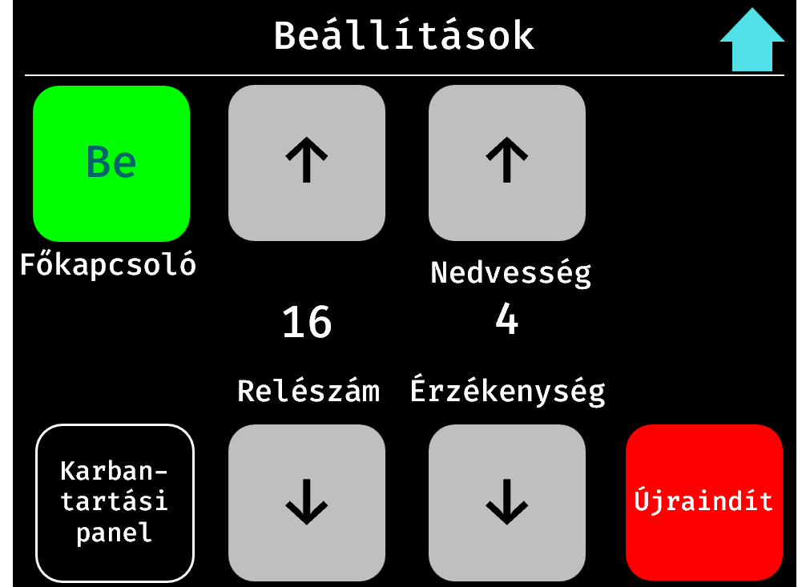

## Fejlesztői beállítások

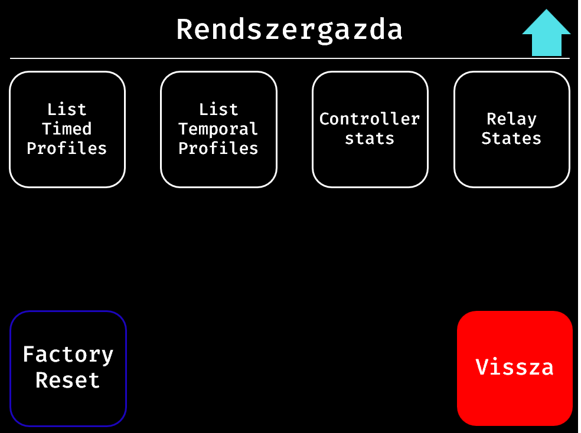

## Idő beállítása

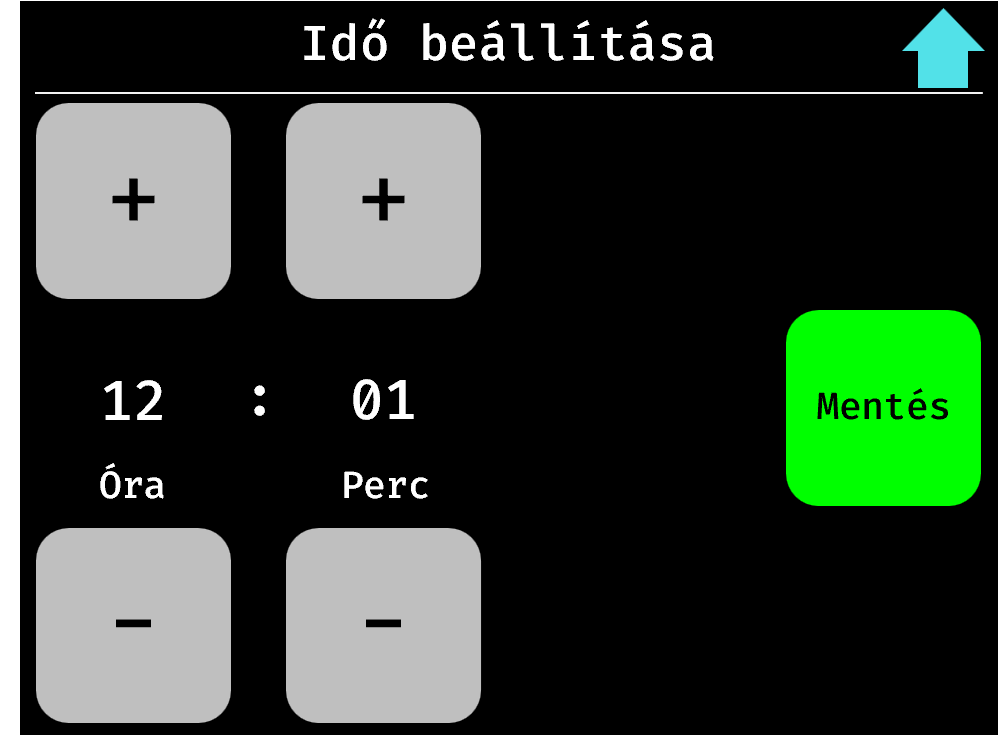
