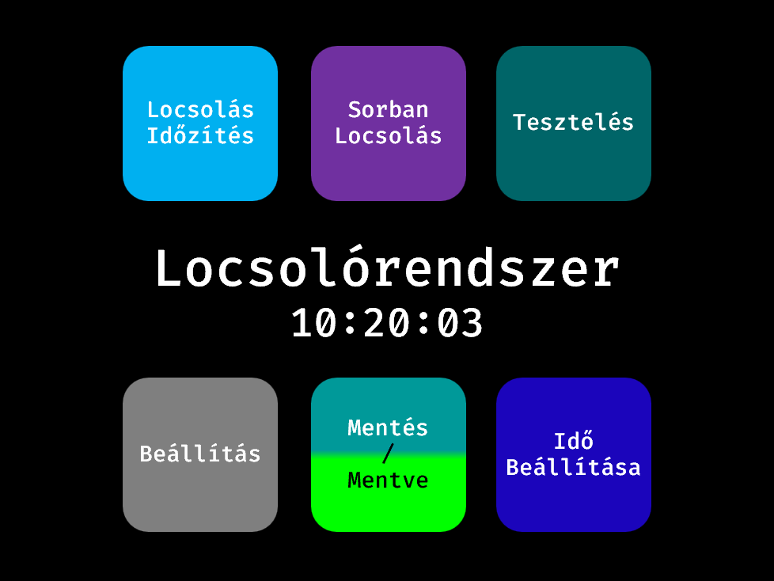
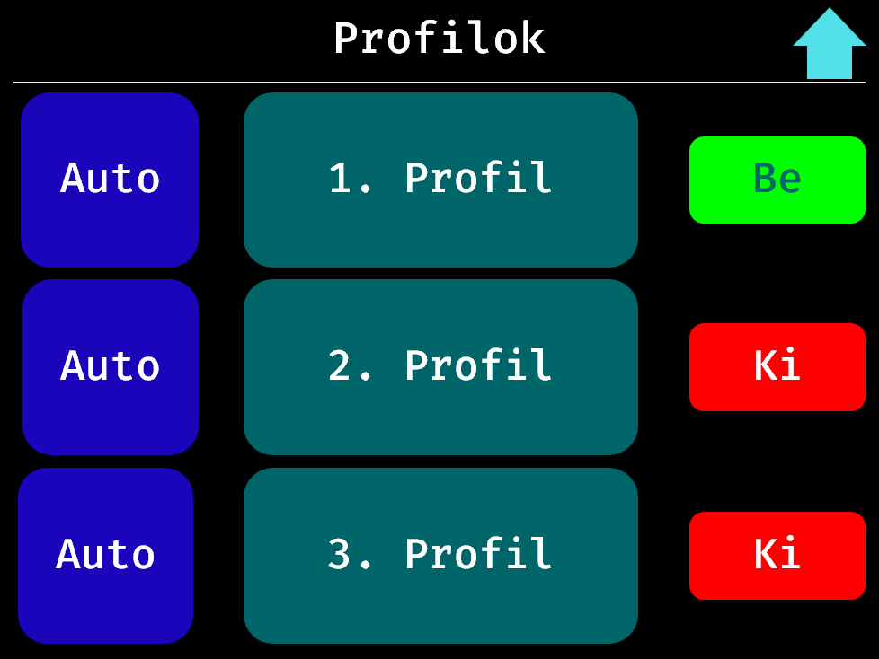
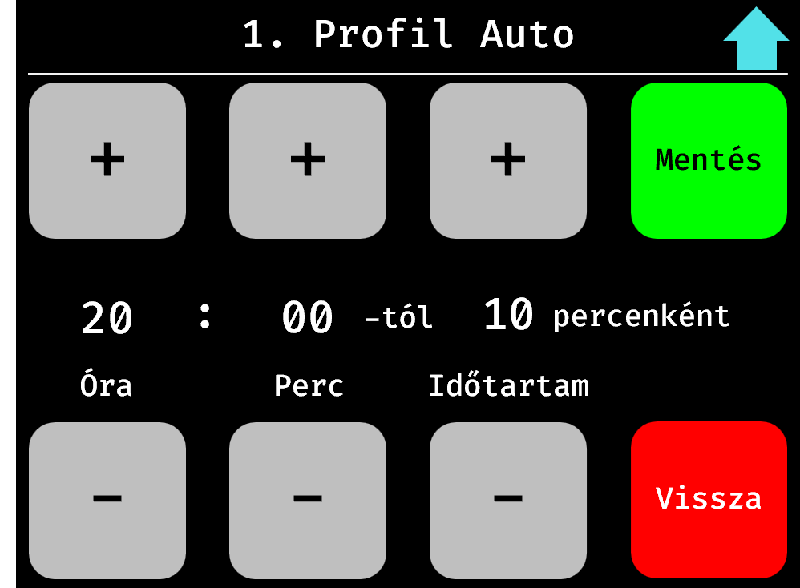
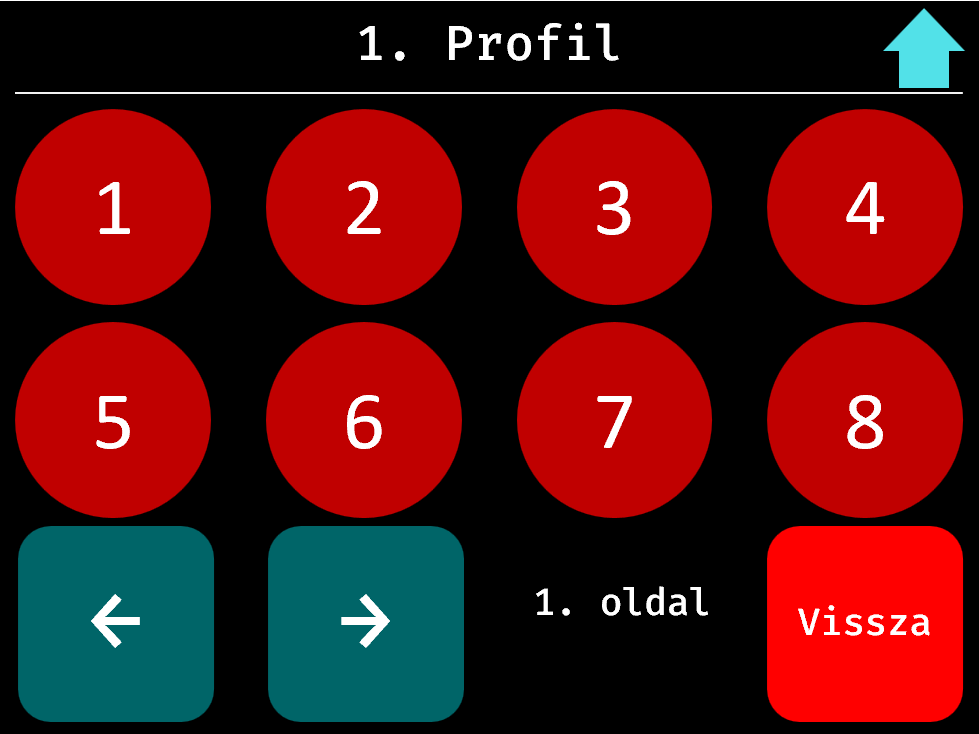
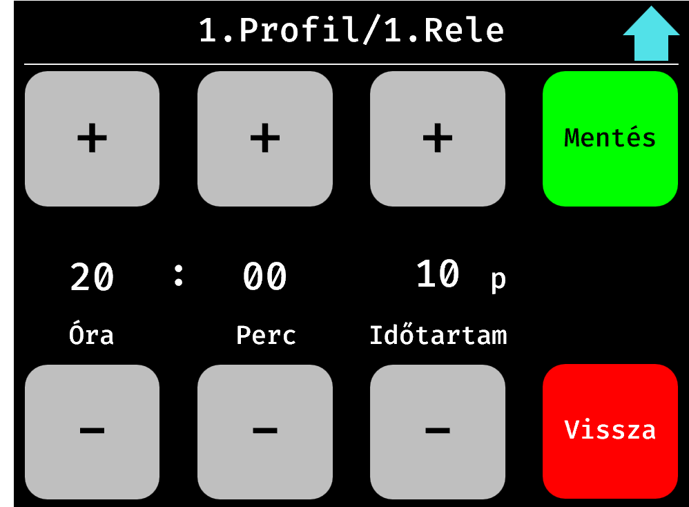
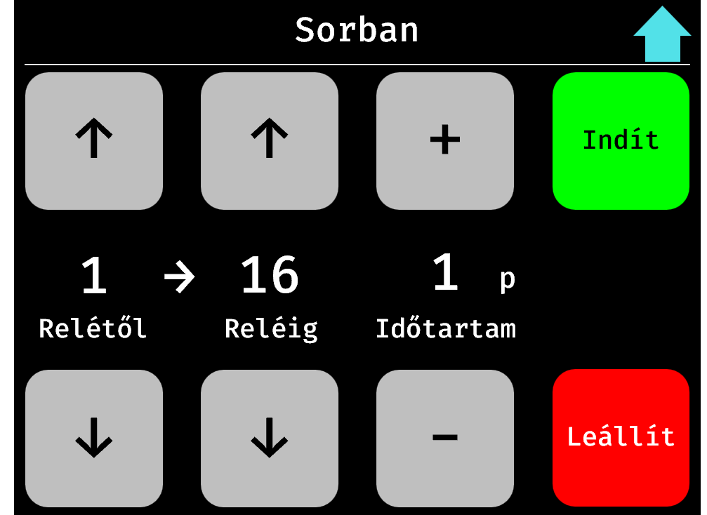
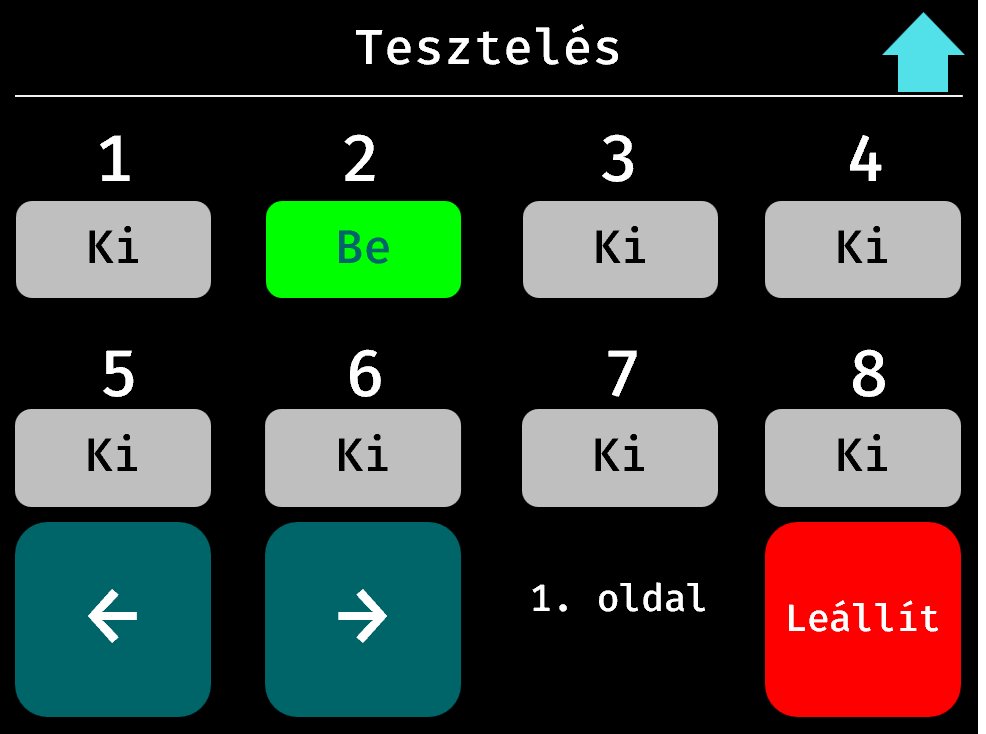
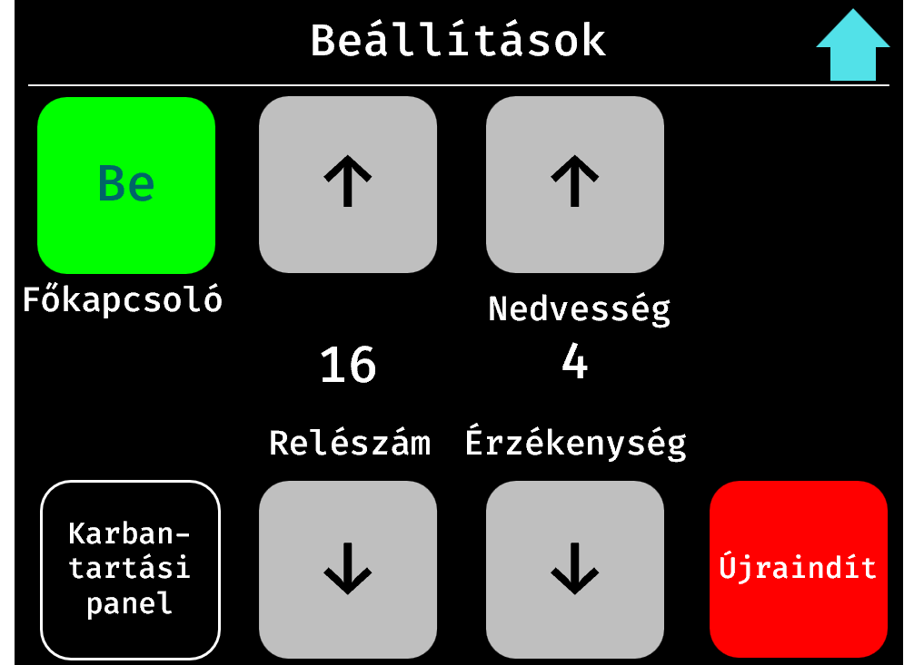
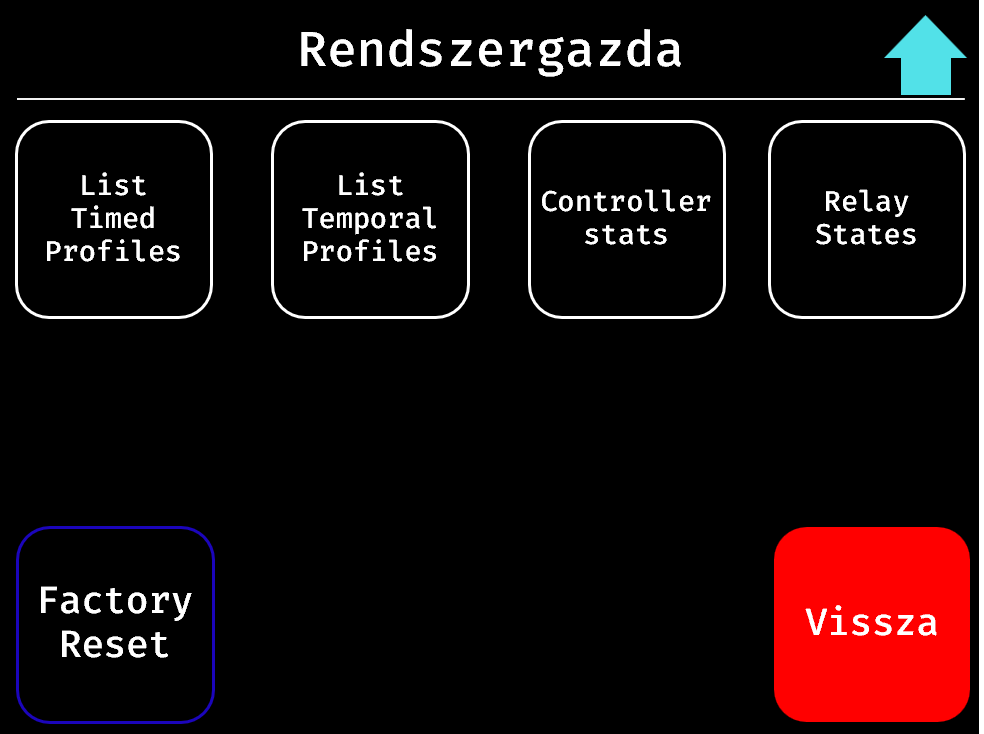
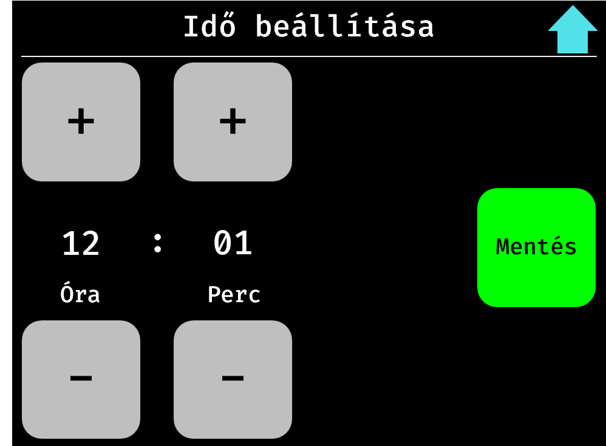

# Locsolórendszer - MinimalistGUI_v2024

> Írta: Szenes Márton
> 2024.08.04.

---

# Tartalom

# Menürendszer

## Főképernyő

### Időzítés mentése

## Locsolás időzítés

### Profil választó

### Automatizált időzítés

### Relé választás

### Relé időzítése manuálisan

## Sorban locsolás

## Tesztelés

## Beállítások

## Fejlesztői beállítások

## Idő beállítása

