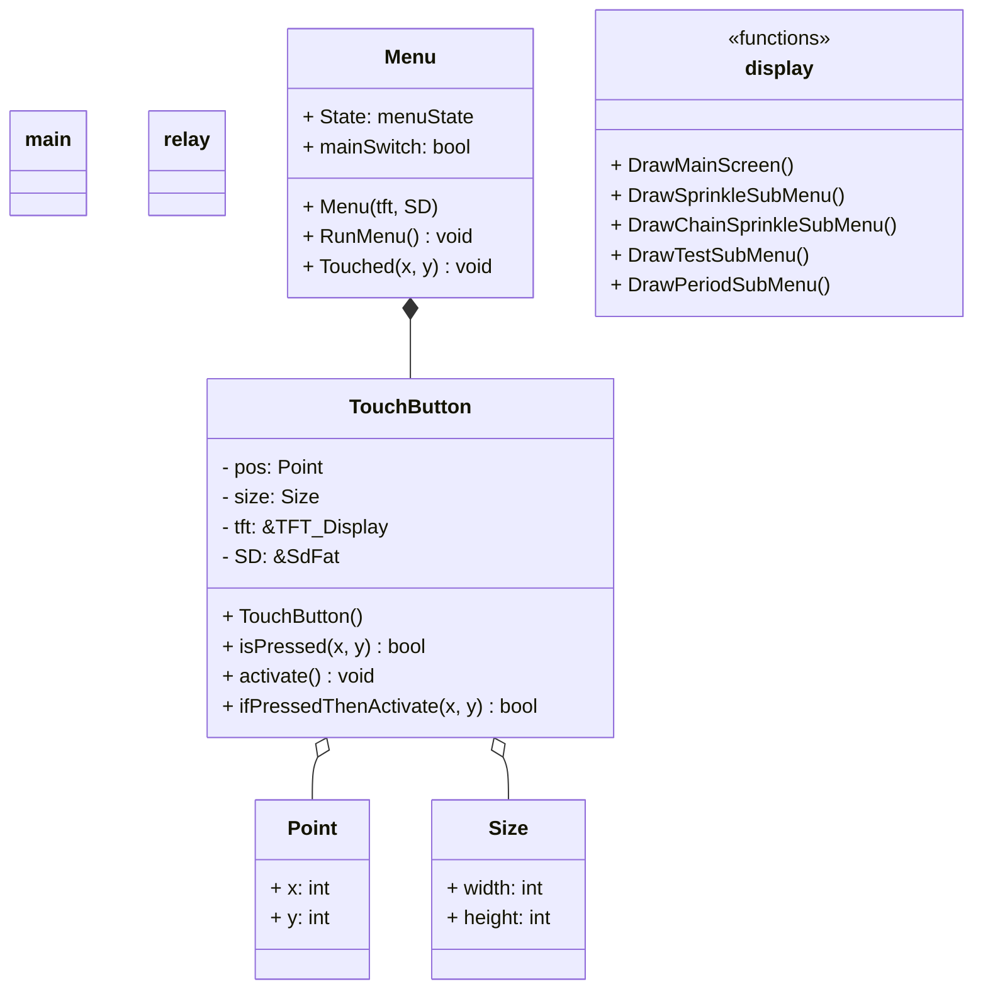

# Locsolórendszer 2024-es változat

> Készítette: Szenes Márton

---

## Menürendszer

- MainScreen
  - Locsolás (BTN)
  - Sorban (BTN)
  - Tesztelés (BTN)
  - Nedvesség (BTN)
  - Beállítások (BTN)
  - Ki/Be (BTN)
  - Idő (BTN)
    - home
    - óra ↑ (BTN)
    - óra ↓ (BTN)
    - perc ↑ (BTN)
    - perc ↓ (BTN)
-

## Gombok

- Általánosak: [] : vissza, mentés
- MainScreen: **[7]** : Locsolás, Sorban, Tesztelés, Nedvesség, Időzítés, Be/Ki, Idő
- Idő beállítás: **[4]** : óra fel, óra le, perc fel, perc le
- Időszakok: **[6]** : 1.időszak, 2.időszak, 3.időszak, 1.On/Off, 2.On/Off, 3.On/Off
- Időzítés beállítás: **[8]** : Relé fel, Relé le, óra fel, óra le, perc fel, perc le, időtartam fel, időtartam le
- Sorban: **[7]** V: Indítás, relétől fel, relétől le, reléig fel, reléig le, időtartam fel, időtartam le
- Tesztelés **[10]** : (1-8) (9-16) kapcsoló, lapozás előre, lapozás vissza
- Nedvesség :
- Beállítások :

### Gombok kiosztása

## Osztályszerkezet

