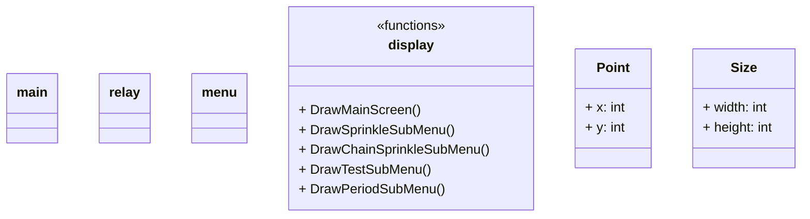

# Locsolórendszer 2024-es változat

> Készítette: Szenes Márton
---

## Menürendszer

- MainScreen
  - Locsolás (BTN)
  - Sorban (BTN) 
  - Tesztelés (BTN)
  - Nedvesség (BTN)
  - Beállítások (BTN)
  - Ki/Be (BTN)
  - Idő (BTN)
    - home
    - óra ↑ (BTN)
    - óra ↓ (BTN)
    - perc ↑ (BTN)
    - perc ↓ (BTN)
- 

## Gombok

- Általánosak: [] : vissza, mentés
- MainScreen: **[7]** : Locsolás, Sorban, Tesztelés, Nedvesség, Időzítés, Be/Ki, Idő
- Idő beállítás: **[4]** : óra fel, óra le, perc fel, perc le
- Időszakok: **[6]** : 1.időszak, 2.időszak, 3.időszak, 1.On/Off, 2.On/Off, 3.On/Off
- Időzítés beállítás: **[8]** : Relé fel, Relé le, óra fel, óra le, perc fel, perc le, időtartam fel, időtartam le
- Sorban: **[7]** V: Indítás, relétől fel, relétől le, reléig fel, reléig le, időtartam fel, időtartam le 
- Tesztelés **[10]** : (1-8) (9-16) kapcsoló, lapozás előre, lapozás vissza  
- Nedvesség :
- Beállítások :

### Gombok kiosztása

- MainScreen 7 db: `buttons[0-6]`
  - `[0]` Bekapcsoló gomb
  - `[1]` Valós idő beállító gomb
  - `[2]` Beállítások gomb
  - `[3]` Locsolás időzítés
  - `[4]` Sorban locsolás
  - `[5]` Tesztelés
  - `[6]` Nedvesség
- Valós idő beállítás 4 db: `buttons[7-10]`
  - `[7]` Óra ↑
  - `[8]` Óra ↓
  - `[9]` Perc ↑
  - `[10]` Perc ↓
- Időszakok 6 db: `buttons[11-16]`
  - `[11]` 1. Időszak
  - `[12]` 1. Kapcsoló
  - `[13]` 2. Időszak
  - `[14]` 2. Kapcsoló
  - `[15]` 3. Időszak
  - `[16]` 3. Kapcsoló
- Időzítés beállítás 8 db: `buttons[17-24]`
  - `[17]` Relé ↑
  - `[18]` Relé ↓
  - `[19]` Óra ↑
  - `[20]` Óra ↓
  - `[21]` Perc ↑
  - `[22]` Perc ↓
  - `[23]` Időtartam ↑
  - `[24]` Időtartam ↓
- Sorban locsolás 7 db: `buttons[25-31]`
  - `[25]` Relétől ↑
  - `[26]` Relétől ↓
  - `[27]` Reléig ↑
  - `[28]` Reléig ↓
  - `[29]` Időtartam ↑
  - `[30]` Időtartam ↓
  - `[31]` Indítás
- Tesztelés 10 db: `buttons[32-41]`
  - `[32]` 1 (9) kapcsoló
  - `[33]` 2 (10) kapcsoló
  - `[34]` 3 (11) kapcsoló
  - `[35]` 4 (12) kapcsoló
  - `[36]` 5 (13) kapcsoló
  - `[37]` 6 (14) kapcsoló
  - `[38]` 7 (15) kapcsoló
  - `[39]` 8 (16) kapcsoló
  - `[40]` Lapozás balra
  - `[41]` Lapozás jobbra
- 

- Általános gombok: buttons[]

### Locsolás

### Sorban

## Osztályszerkezet

