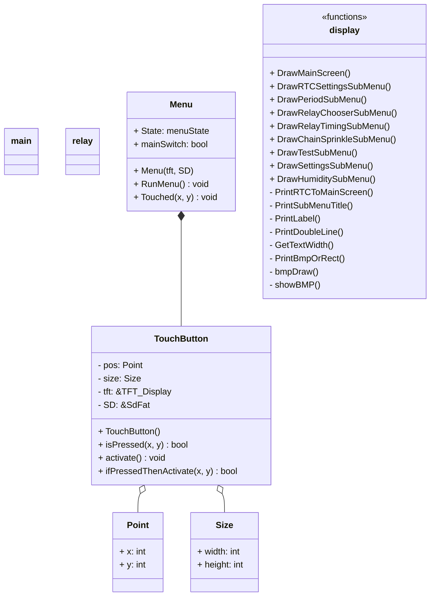

# Locsolórendszer 2024-es változat

> Készítette: Szenes Márton

---

## Teendők

- [ ] Képernyők Dinamikus frissítése
- MainScreen
  - Locsolás időzítés
    - [ ] Automatikus locsolás
      - [ ] Funkcionalitás
      - [ ] Szám mezők dinamikus változtatása
      - [x] Kijelzés
      - [ ] Vissza
    - [ ] Relénkénti beállítás
      - [ ] Állító gombok funkcionalitása
      - [ ] Automatikusból mentés és vissza text
      - [x] Title beállítása
  - Sorban locsolás
    - [ ] Funkcionalitás a gombokhoz
    - [ ] Szám mezők dinamikus változtatása
  - Tesztelés
    - [ ] Funkcionalitás a gombokhoz
  - Nedvesség
    - [ ] Funkcionalitás a gombokhoz
    - [ ] Szám mezők dinamikus változtatása
  - Beállítások
  - Ki/Be kapcsoló gomb
    - [ ]
  - Idő beállítás
    - [ ] Funkcionalitás a gombokhoz
    - [ ] Szám mezők dinamikus változtatása

## Hibák

- Időszak gomb title hiba
- Relé időzítésénél title hiba
- Relé számok eltolása balra kicsit

## Gombok

- Általánosak: [] : vissza, mentés
- MainScreen: **[7]** : Locsolás, Sorban, Tesztelés, Nedvesség, Időzítés, Be/Ki, Idő
- Idő beállítás: **[4]** : óra fel, óra le, perc fel, perc le
- Időszakok: **[6]** : 1.időszak, 2.időszak, 3.időszak, 1.On/Off, 2.On/Off, 3.On/Off
- Időzítés beállítás: **[8]** : Relé fel, Relé le, óra fel, óra le, perc fel, perc le, időtartam fel, időtartam le
- Sorban: **[7]** V: Indítás, relétől fel, relétől le, reléig fel, reléig le, időtartam fel, időtartam le
- Tesztelés **[10]** : (1-8) (9-16) kapcsoló, lapozás előre, lapozás vissza
- Nedvesség :
- Beállítások :

## Osztályszerkezet

