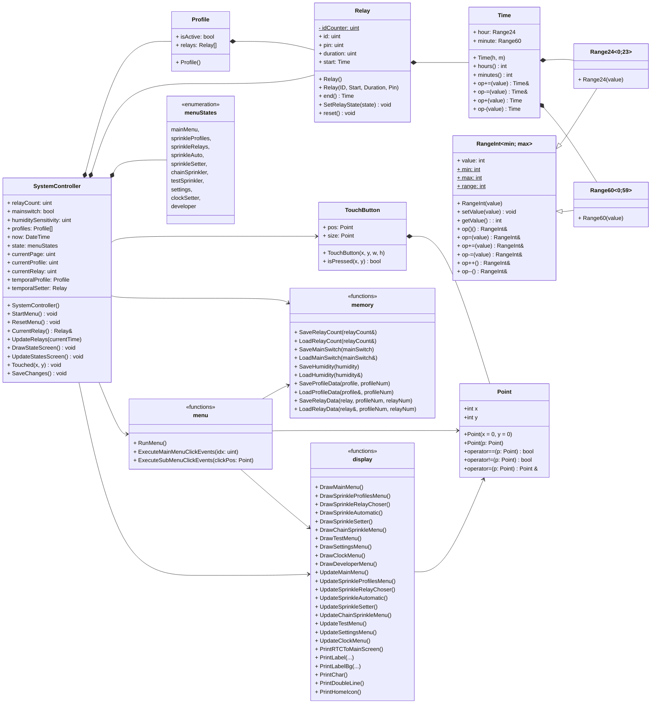
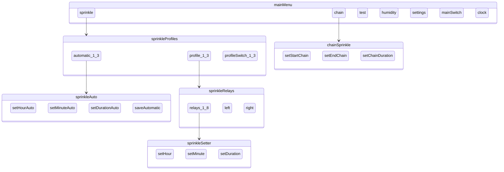

# Locsolórendszer v2024

> Készítette: Szenes Márton

---

## Menürendszer

### Gombok kiosztása

## Osztályszerkezet

```mermaid
classDiagram
    direction LR
    class menuStates{
        <<enumeration>>
        mainMenu, 
        sprinkleProfiles,
        sprinkleRelays,
        sprinkleAuto,
        sprinkleSetter,
        chainSprinkler,
        testSprinkler,
        settings,
        clockSetter,
        developer
    }
    class Point {
        +int x
        +int y
        +Point(x = 0, y = 0)
        +Point(p: Point)
        +operator==(p: Point) bool
        +operator!=(p: Point) bool
        +operator=(p: Point) Point &
    }
    class RangeInt~min; max~{
        + value: int
        + min: int$
        + max: int$
        + range: int$
        + RangeInt(value)
        + setValue(value) void
        + getValue(): int
        + op()() RangeInt&
        + op=(value) RangeInt&
        + op+=(value) RangeInt&
        + op-=(value) RangeInt&
        + op++() RangeInt&
        + op--() RangeInt&
    }
    class Range60~0;59~{
        + Range60(value)
    }
    class Range24~0;23~{
        + Range24(value)
    }
    class Time{
        + hour: Range24
        + minute: Range60
        + Time(h, m)
        + hours() int
        + minutes() int
        + op+=(value) Time&
        + op-=(value) Time&
        + op+(value) Time
        + op-(value) Time      
    }
    class TouchButton{
        + pos: Point
        + size: Point
        + TouchButton(x, y, w, h)
        + isPressed(x, y) bool
    }
    class Relay{
        - idCounter: uint$
        + id: uint
        + pin: uint
        + duration: uint 
        + start: Time
        + Relay()
        + Relay(ID, Start, Duration, Pin)
        + end() Time
        + SetRelayState(state) void
        + reset() void
    }
    class Profile{
        + isActive: bool
        + relays: Relay[]
        + Profile()
    }
    class SystemController{
        + relayCount: uint
        + mainswitch: bool
        + humiditySensitivity: uint
        + profiles: Profile[]
        + now: DateTime
        + state: menuStates
        + currentPage: uint
        + currentProfile: uint
        + currentRelay: uint
        + temporalProfile: Profile
        + temporalSetter: Relay
        + SystemController()
        + StartMenu() void
        + ResetMenu() void
        + CurrentRelay() Relay&        
        + UpdateRelays(currentTime)
        + DrawStateScreen() void
        + UpdateStatesScreen() void
        + Touched(x, y) void
        + SaveChanges() void
    }

    RangeInt <|-- Range24
    RangeInt <|-- Range60
    Time *-- Range24
    Time *-- Range60

    SystemController *-- Profile
    SystemController *-- Relay
    SystemController *-- menuStates
    SystemController --> TouchButton
    SystemController --> memory
    SystemController --> menu
    SystemController --> display
    
    Profile *-- Relay
    Relay *-- Time
    
    TouchButton *-- Point
    
    menu --> memory
    menu --> Point
    menu --> display
    
    display --> Point
    
    class display{
        <<functions>>
        + DrawMainMenu()
        + DrawSprinkleProfilesMenu()
        + DrawSprinkleRelayChoser()
        + DrawSprinkleAutomatic()
        + DrawSprinkleSetter()
        + DrawChainSprinkleMenu()
        + DrawTestMenu()
        + DrawSettingsMenu()
        + DrawClockMenu()
        + DrawDeveloperMenu()
        + UpdateMainMenu()
        + UpdateSprinkleProfilesMenu()
        + UpdateSprinkleRelayChoser()
        + UpdateSprinkleAutomatic()
        + UpdateSprinkleSetter()
        + UpdateChainSprinkleMenu()
        + UpdateTestMenu()
        + UpdateSettingsMenu()
        + UpdateClockMenu()
        + PrintRTCToMainScreen()
        + PrintLabel(...)
        + PrintLabelBg(...)
        + PrintChar()
        + PrintDoubleLine()
        + PrintHomeIcon()
    }
    class menu{
        <<functions>>
        + RunMenu()
        + ExecuteMainMenuClickEvents(idx: uint)
        + ExecuteSubMenuClickEvents(clickPos: Point)
    }
    class memory{
        <<functions>>
        + SaveRelayCount(relayCount&)
        + LoadRelayCount(relayCount&) 
        + SaveMainSwitch(mainSwitch) 
        + LoadMainSwitch(mainSwitch&)
        + SaveHumidity(humidity)
        + LoadHumidity(humidity&)
        + SaveProfileData(profile, profileNum)
        + LoadProfileData(profile&, profileNum)
        + SaveRelayData(relay, profileNum, relayNum)
        + LoadRelayData(relay&, profileNum, relayNum)
    }
    

```

```mermaid
stateDiagram
%%    direction LR
    state mainMenu{
        sprinkle
        chain
        test
        humidity
        settings
        mainSwitch
        clock
    }
    sprinkle --> sprinkleProfiles
    state sprinkleProfiles{
        automatic_1_3
        profile_1_3
        profileSwitch_1_3
    }
    automatic_1_3 --> sprinkleAuto
    state sprinkleAuto{
        setHourAuto
        setMinuteAuto
        setDurationAuto
        saveAutomatic
    }
    profile_1_3 --> sprinkleRelays
    state sprinkleRelays{
        relays_1_8
        left
        right
    }
    relays_1_8 --> sprinkleSetter
    state sprinkleSetter{
        setHour
        setMinute
        setDuration
    }
    chain --> chainSprinkle
    state chainSprinkle{
        setStartChain
        setEndChain
        setChainDuration
    }
    
```
