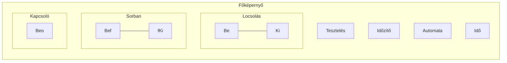

# Locsolórendszer menürendzser

```mermaid 
    flowchart TB 
%%    state Főképernyő {
    subgraph Főképernyő
        direction TB
        subgraph Locsolás 
            Be --- Ki
        end 
        subgraph Sorban 
           Bef --- fKi 
        end
        Tesztelés
        Időzítő
        Automata
        subgraph Kapcsoló
            Beo
        end
        Idő 
    
        
    end 
%%    state Locsolás{
%%        Be --> Ki
%%        Ki --> Be
%%    }
%%    
%%    state Be/Ki{
%%        Bef --> Kif
%%        Kif --> Bef       
%%    }
```