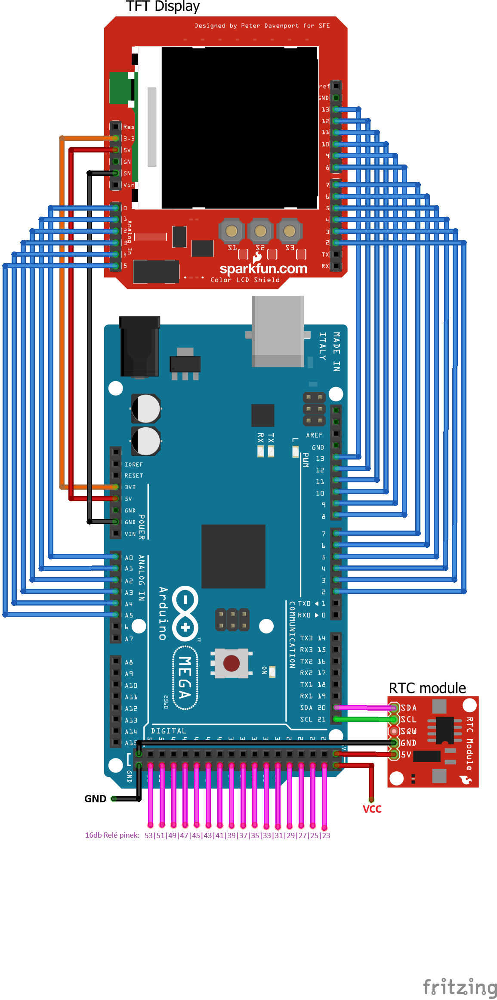

# SprinkleSystem v2024

> Made by: Marton Szenes

This project was made to make sprinkling possible in the garden automatically.
It features many modes, like separate relay timing setting, automatic setting, multiple profiles, test mode, chain sprinkling, and more.

## For users

If the electronic system has been installed, you can check out the [User Manual](Documentacion/UserDoc.md) on how to use the system.
Hope it helps. For any questions make an issue.

## For developer

After the electronics has been installed correctly, follow the next steps for uploading the project to the **Arduino Mega 2560**:
1. Open the [MinimalistSprinklerGUI.ino](MinimalistSprinklerGUI/MinimalistSprinklerGUI.ino) file in the **Arduino IDE**, and wait for the whole project to load.
2. Make sure every necessary library is installed to your device:
   - `Adafruit_GFX.h` - Core graphics library for displaying shapes
   - `MCUFRIEND_kbv.h` - 2,8" TFT display's library to display to the screen
   - `TouchScreen.h` - 2,8" touch screen library for user input
   - `SPI.h ` - a bus library for communication to clock module
   - `SdFat.h` - library for communication to the SD card slot on the display shield
   - `RTClib.h` - real time clock module's library for SCL-SDA communication
3. Compile the project and expect no errors. If any error occur, try to install the remaining libraries or contact me for further instructions.
4. Select the connected serial port and Arduino model in the dropdown menu at the top of the screen.
5. Upload the project to the board. If everything is working properly, you should see the screen flash a few times, than make a black screen clear and the show the main screen shown above.

For deaper understaning of the project you can check out the [Developer Documentation](Documentacion/DEVDOC.md).

## For electricians

This project can support up to 16 switch relays at this point. For this project, you'll need the folowing components:

- 2,8" TFT display shield (with ILI9341 LDC driver)
- RTC Module (DS3231)
- max 16 Relay switches (can be less)
- Jumper cables
- 5-7V power supply for Arduino
- 7-12V power supply for relays

### Schematic

